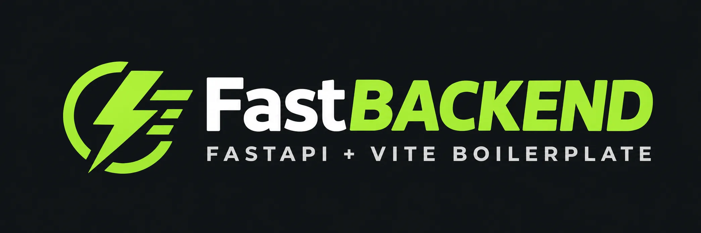

<p align="center">
  
</p>

# Pare de reconstruir auth, tenancy e billing a cada SaaS — clone este kernel com Argon2id + refresh rotativo + tenancy por linha (179 testes backend coletados em Postgres/Redis reais, admin + auditoria append-only + backup criptografado inclusos) e lance seu produto em dias, não meses.

> 🇧🇷 [English](README.md) | **Português (BR)** — A documentação profunda (`docs/`) está em PT-BR; este README também existe em [inglês](README.md).

<!-- status -->
<p align="center">
  <a href="https://github.com/andersonlimacrv/fast-backend/actions/workflows/ci.yml"></a>
  <a href="https://github.com/andersonlimacrv/fast-backend/releases"></a>
  <a href="pyproject.toml"></a>
  <a href="LICENSE"></a>
</p>
<!-- backend stack -->
<p align="center">
  
  
  
  
  
</p>
<!-- frontend stack -->
<p align="center">
  
  
  
  
</p>
<!-- test tiers (medido 2026-09-17: `uv run pytest --collect-only -m unit` → 90, `-m integration` → 89; `npm run test:run -- --reporter=json` → 102 passed; `playwright test --list` → 14. Unit verdes são 89 + 1 falha pré-existente só-neste-worktree em test_new_project, ver CHANGELOG.) -->
<p align="center">
  
  
  
  
</p>

| Fato | Valor |
|---|---|
| Release | [releases](https://github.com/andersonlimacrv/fast-backend/releases) (kernel `0.1.0`, Fases 0–12; medido 2026-09-17) |
| Backend | 179 coletados — 90 unit + 89 integration (Postgres/Redis reais; medido 2026-09-17) |
| Frontend | 102 vitest + 14 Playwright (`client/`; medido 2026-09-17) |
| Specs | 37 capabilities em [`openspec/specs/`](openspec/specs/) |
| Decisões | 13 ADRs em [`docs/adr/`](docs/adr/) · auto-release ([ADR 0011](docs/adr/0011-auto-release.md)) + guard ([ADR 0012](docs/adr/0012-release-guard.md)) |

- **Notas de release:** [`CHANGELOG.md`](./CHANGELOG.md) — releases automáticas a cada PR mergeado ([ADR 0011](docs/adr/0011-auto-release.md)), PRs de comportamento com gate [`release-check.yml`](.github/workflows/release-check.yml) ([ADR 0012](docs/adr/0012-release-guard.md)).
- **Comece aqui:** [Começando](#começando) (`make setup` → `make dev` → `make check`) · manual [`docs/Makefile.pt-BR.md`](docs/Makefile.pt-BR.md).
- **Construa em cima:** [Gerar código futuro a partir daqui](#gerar-código-futuro-a-partir-daqui) · novo módulo em 5 passos [`docs/guides/add-module.md`](docs/guides/add-module.md) · arquitetura [`docs/ARCHITECTURE.md`](docs/ARCHITECTURE.md) · escala [`docs/SCALING.md`](docs/SCALING.md).
- **Regras:** `AGENTS.md` → `docs/RULES.md` → `docs/ROADMAP.md` → `docs/adr/*` → `references/*` (congelada).

## Índice

1. [Começando](#começando)
2. [Frontend (dev)](#frontend-dev)
3. [Testar / verificar](#testar--verificar)
4. [Build / deploy](#build--deploy)
5. [Backup](#backup)
6. [Gerar código futuro a partir daqui](#gerar-código-futuro-a-partir-daqui)
7. [Estrutura](#estrutura)
8. [Skills](#skills)
9. [Privacidade e LGPD](#privacidade-e-lgpd)
10. [Arquitetura e escala](#arquitetura-e-escala)
11. [Contribuindo](#contribuindo)
12. [Licença](#licença)

## Começando

O `Makefile` é o ponto único de entrada — rode `make help` para listar tudo (manual em `docs/Makefile.pt-BR.md`).

### 0. Pré-requisitos

Python ≥3.11, `uv`, Docker, Node 20+ (`npm`), Git.

> Rode o `make` a partir do **Git Bash** no Windows — as receitas são bash (`!`, `awk` falham sob cmd).

### 1. Primeira execução — do zero ao rodando

```bash
make setup   # .env + deps + checagem de drift + migrations
make dev     # stack backend (docker) + frontend (:5173)
```

- API → http://127.0.0.1:8000/docs · SPA → http://localhost:5173 (`/` landing pública, `/~` home logada, `/admin*` staff).
- Precisa de `client/.env` (`VITE_API_URL=http://localhost:8000`, ver `client/.env.example`) e `CORS_ORIGINS=["http://localhost:5173"]` no backend.

```bash
make api     # API com reload → http://127.0.0.1:8000/docs (precisa do db: make db-up)
```

### 2. Primeiro usuário (root one-shot)

```bash
make admin-bootstrap email=voce@example.com   # email válido; senha 2x via prompt (min 8)
```

Depois logue como root (`POST /auth/login` ou a SPA). Runbook completo + checklist do `bootstrap failed`: `docs/DEPLOYMENT.pt-BR.md` ("Bootstrap do root", "Primeiro usuário em dev").

<details>
<summary>Por baixo dos panos</summary>

```bash
cp .env.example .env                       # make env-template (nunca sobrescreve)
uv sync --extra dev                        # make sync
uv run alembic upgrade head                # make migrate
uv run uvicorn app.main:create_app --factory --host 127.0.0.1 --port 8000 --reload  # make api
```

</details>

Com Docker (app + worker + postgres + redis; `tools` p/ mailpit/minio):

```bash
make up      # app + worker + db + redis
make tools   # profiles mailpit + minio
```

<details>
<summary>Por baixo dos panos</summary>

```bash
docker compose up -d --build                # make up (precisa de .env)
docker compose --profile tools up -d --build  # make tools
```

</details>

## Frontend (dev)

```bash
make web-install   # uma vez: npm ci em client/
make dev           # stack backend + Vite dev → http://localhost:5173 (ou `make web` só p/ o frontend)
```

Landing pública em `/`, home logada em `/~`, login two-step, admin em `/admin*` (staff). Notas de privacidade em `docs/PRIVACY.pt-BR.md`.

<details>
<summary>Por baixo dos panos</summary>

```bash
cd client && npm ci
cd client && npm run dev -- --port 5173 --strictPort
```

Precisa de `client/.env` (`VITE_API_URL=http://localhost:8000`, ver `client/.env.example`) e `CORS_ORIGINS=["http://localhost:5173"]` no backend. SPA de visualização read-only — detalhes em `client/README.md`.

</details>

## Testar / verificar

### 2. Verifique seu setup

```bash
make check       # gate local de PR: lint + types + arch + testes unitários (rode antes de cada push)
make test-unit   # rápidos, sem serviços
make test        # suite completa (precisa de Docker)
```

Troubleshooting: drift de `.env` → `make env-check`; bridge Docker bloqueada → `FB_TEST_NETWORK=host uv run pytest` (`make test-host`); CORS/SPA em branco → confira `client/.env` + `CORS_ORIGINS`.

<details>
<summary>Por baixo dos panos</summary>

```bash
uv run pytest -m "unit"                       # make test-unit
uv run pytest -m "integration"                # make test-integration (Postgres+Redis reais via testcontainers)
FB_TEST_NETWORK=host uv run pytest            # make test-host (onde bridge Docker é bloqueada)
uv run ruff check app scripts && uv run ruff format --check app scripts  # make lint
uv run mypy app scripts                       # make types
uv run lint-imports                            # make arch (DAG de módulos)
uv run bandit -r app scripts -q -ll && uv run pip-audit && gitleaks detect --source . --no-git  # make security
```

</details>

## Build / deploy

```bash
make build IMAGE=ghcr.io/<org>/fast-backend TAG=<sha>
```

<details>
<summary>Por baixo dos panos</summary>

```bash
docker build --target prod -t ghcr.io/<org>/fast-backend:<sha> .  # make build (BUILD_TARGET=prod, nunca :latest)
IMAGE=ghcr.io/<org>/fast-backend:<sha> docker compose -f docker-compose.prod.yml up -d
```

</details>

Push na `main` deploya via `.github/workflows/deploy.yml` (migrate → healthcheck `/readyz` → rollback automático). Rollback manual: `rollback.yml` com a SHA. Detalhes em `docs/DEPLOYMENT.md`.

## Backup

```bash
make backup              # backup criptografado p/ ./var/backups (precisa BACKUP_PASSPHRASE + DATABASE_URL)
make restore FILE=<artefato> CONFIRM=1
```

<details>
<summary>Por baixo dos panos</summary>

```bash
BACKUP_PASSPHRASE=... python scripts/backup.py --database-url ... --dest ./var/backups
python scripts/backup.py --restore <artefato> --database-url ...
```

</details>

## Gerar código futuro a partir daqui

Reuse este repo como template e gere código no fluxo spec-driven:

```bash
make new-project name=my-saas dest=/path/to/my-saas   # 1. fork: copia a árvore menos VCS/venvs/caches, renomeia o pacote
make change name=my-feature                            # 2. spec primeiro: cria openspec/changes/my-feature/ (proposal antes de código, ver AGENTS.md)
make migration msg="add my table" && make migrate      # 3. evolua o schema (revise o autogenerate, depois aplique)
make check                                             # 4. gate antes do push (lint + types + arch + unit)
```

Novo módulo em 5 passos: `docs/guides/add-module.md`. Manual completo: `docs/Makefile.pt-BR.md`. PRs de comportamento exigem entrada no `CHANGELOG.md` sob `[Unreleased]` (docs-only passa) — ver `.github/workflows/release-check.yml`.

## Estrutura

```text
app/                  # pacote (imports from app.*)
├── core/             # errors, settings, security port, contracts/
├── infrastructure/   # auth, db, email, storage, jobs, observability, payments, security
├── modules/          # admin, audit, billing_stripe, entitlements, identity, organization, projects, tenancy
├── interfaces/       # errors, health (/healthz, /readyz), meta (/meta)
├── migrations/       # Alembic 0001–0008
└── tests/            # unit, integration, e2e, fixtures
scripts/              # auto_release.py, backup.py, bootstrap_root.py, deploy.py, e2e_spa_flow.py, env_check.py, new_project.py, release_notes.py
openspec/             # specs (37 capabilities, medido 2026-09-17) + changes arquivadas
docs/                 # RULES, ROADMAP, ARCHITECTURE, SCALING, DEPLOYMENT, guides/, ADRs
```

Rode `make help` para todos os comandos (manual em `docs/Makefile.pt-BR.md`). Sobrescreva variáveis `?=` na linha de comando em vez de editar receitas — ex. `make api PORT=9000`, `make build IMAGE=minhaorg/app TAG=abc1234`.

## Skills

Skills de agente em `.opencode/skills/` (ver `docs/SKILLS-REGISTRY.md`):

- `openspec-*` — workflow spec-driven (propose/verify/archive de changes).
- `documentation-and-adrs`, `docs-generate` — alimentam README/API/ADR/CHANGELOG a partir do código.
- `git-workflow-and-versioning`, `shipping-and-launch`, `ci-cd-and-automation` — releases, changelogs, pipelines.
- `cmd-makefile`, `writing-makefiles` — referências base de Makefile.
- `makefile-keeper` — mantém o Makefile deste repo no padrão.
- `lgpd-*` — bundle de auditoria LGPD (maestro + 18 sub-skills); trilha em `.lgpd/`.

## Privacidade e LGPD

Sanitizado por desenho: só hashes Argon2id (nunca texto puro), tokens opacos só-hash, zero trackers/CDN/fontes na SPA, auditoria sem segredos (provado por `test_leak_audit.py`). Inventário completo, bases legais e retenção em [`docs/PRIVACY.pt-BR.md`](docs/PRIVACY.pt-BR.md); artefatos em `.lgpd/` (STATUS, mapa, ROPA-track, runbook). Este aviso não é aconselhamento jurídico — revisão do DPO/jurídico antes da produção.

## Arquitetura e escala

- `docs/ARCHITECTURE.md` — mapa de módulos, DAG, fluxos, índice de ADRs.
- `docs/SCALING.md` — knobs reais, ordem vertical-first, gatilhos futuros.
- `docs/guides/add-module.md` — criar um módulo em 5 passos.
- Regras: `AGENTS.md` (leia antes de codar) → `docs/RULES.md` → `docs/ROADMAP.md` → `docs/adr/*` → `references/*` (congelada). Sem `backend/` — o diretório da aplicação é `app/`.

## Contribuindo

Ver [`CONTRIBUTING.md`](CONTRIBUTING.md). Resumo: OpenSpec change antes de código relevante, Conventional Commits, gates verdes, sem segredos. Vulnerabilidades: [`SECURITY.md`](SECURITY.md) (não abra issue pública).

## Licença

MIT — ver `LICENSE`.
