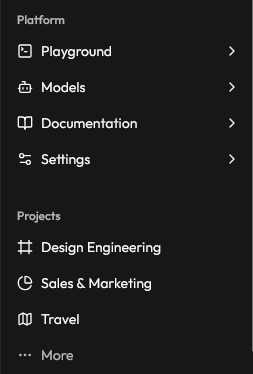

# IMG REF:

  
Sidebar

URL: [https://animate-ui.com/docs/components/radix/sidebar](https://animate-ui.com/docs/components/radix/sidebar)

URL: /docs/components/radix/sidebar

CLI: npx shadcn@latest add @animate-ui/components-radix-sidebar


DEMO:  

'use client';

import * as React from 'react';

import {

  Breadcrumb,

  BreadcrumbItem,

  BreadcrumbLink,

  BreadcrumbList,

  BreadcrumbPage,

  BreadcrumbSeparator,

} from '@/components/ui/breadcrumb';

import { Separator } from '@/components/ui/separator';

import {

  SidebarProvider,

  SidebarInset,

  SidebarTrigger,

  Sidebar,

  SidebarHeader,

  SidebarContent,

  SidebarFooter,

  SidebarRail,

  SidebarGroup,

  SidebarGroupLabel,

  SidebarMenu,

  SidebarMenuItem,

  SidebarMenuButton,

  SidebarMenuSub,

  SidebarMenuSubItem,

  SidebarMenuSubButton,

  SidebarMenuAction,

} from '@/components/animate-ui/components/radix/sidebar';

import {

  Collapsible,

  CollapsibleContent,

  CollapsibleTrigger,

} from '@/components/animate-ui/primitives/radix/collapsible';

import {

  DropdownMenu,

  DropdownMenuContent,

  DropdownMenuGroup,

  DropdownMenuItem,

  DropdownMenuLabel,

  DropdownMenuSeparator,

  DropdownMenuShortcut,

  DropdownMenuTrigger,

} from '@/components/animate-ui/components/radix/dropdown-menu';

import {

  AudioWaveform,

  BadgeCheck,

  Bell,

  BookOpen,

  Bot,

  ChevronRight,

  ChevronsUpDown,

  Command,

  CreditCard,

  Folder,

  Forward,

  Frame,

  GalleryVerticalEnd,

  LogOut,

  Map,

  MoreHorizontal,

  PieChart,

  Plus,

  Settings2,

  Sparkles,

  SquareTerminal,

  Trash2,

} from 'lucide-react';

import {

  Avatar,

  AvatarFallback,

  AvatarImage,

} from '@/components/ui/avatar';

import { useIsMobile } from '@/hooks/use-mobile';

const DATA = {

  user: {

```
name: 'Skyleen',

email: '[skyleen@example.com](mailto:skyleen@example.com)',

avatar:

  '[https://pbs.twimg.com/profile_images/1909615404789506048/MTqvRsjo_400x400.jpg](https://pbs.twimg.com/profile_images/1909615404789506048/MTqvRsjo_400x400.jpg)',
```

  },

  teams: [

```
{

  name: 'Acme Inc',

  logo: GalleryVerticalEnd,

  plan: 'Enterprise',

},

{

  name: 'Acme Corp.',

  logo: AudioWaveform,

  plan: 'Startup',

},

{

  name: 'Evil Corp.',

  logo: Command,

  plan: 'Free',

},
```

  ],

  navMain: [

```
{

  title: 'Playground',

  url: '#',

  icon: SquareTerminal,

  isActive: true,

  items: [

    {

      title: 'History',

      url: '#',

    },

    {

      title: 'Starred',

      url: '#',

    },

    {

      title: 'Settings',

      url: '#',

    },

  ],

},

{

  title: 'Models',

  url: '#',

  icon: Bot,

  items: [

    {

      title: 'Genesis',

      url: '#',

    },

    {

      title: 'Explorer',

      url: '#',

    },

    {

      title: 'Quantum',

      url: '#',

    },

  ],

},

{

  title: 'Documentation',

  url: '#',

  icon: BookOpen,

  items: [

    {

      title: 'Introduction',

      url: '#',

    },

    {

      title: 'Get Started',

      url: '#',

    },

    {

      title: 'Tutorials',

      url: '#',

    },

    {

      title: 'Changelog',

      url: '#',

    },

  ],

},

{

  title: 'Settings',

  url: '#',

  icon: Settings2,

  items: [

    {

      title: 'General',

      url: '#',

    },

    {

      title: 'Team',

      url: '#',

    },

    {

      title: 'Billing',

      url: '#',

    },

    {

      title: 'Limits',

      url: '#',

    },

  ],

},
```

  ],

  projects: [

```
{

  name: 'Design Engineering',

  url: '#',

  icon: Frame,

},

{

  name: 'Sales &amp; Marketing',

  url: '#',

  icon: PieChart,

},

{

  name: 'Travel',

  url: '#',

  icon: Map,

},
```

  ],

};

export const RadixSidebarDemo = () =&gt; {

  const isMobile = useIsMobile();

  const [activeTeam, setActiveTeam] = React.useState(DATA.teams[0]);

  if (!activeTeam) return null;

  return (

```
&lt;SidebarProvider&gt;

  &lt;Sidebar collapsible="icon"&gt;

    &lt;SidebarHeader&gt;

      {/* Team Switcher */}

      &lt;SidebarMenu&gt;

        &lt;SidebarMenuItem&gt;

          &lt;DropdownMenu&gt;

            &lt;DropdownMenuTrigger asChild&gt;

              &lt;SidebarMenuButton

                size="lg"

                className="data-[state=open]:bg-sidebar-accent data-[state=open]:text-sidebar-accent-foreground"

              &gt;

                &lt;div className="flex aspect-square size-8 items-center justify-center rounded-lg bg-sidebar-primary text-sidebar-primary-foreground"&gt;

                  &lt;activeTeam.logo className="size-4" /&gt;

                &lt;/div&gt;

                &lt;div className="grid flex-1 text-left text-sm leading-tight"&gt;

                  &lt;span className="truncate font-semibold"&gt;

                    {[activeTeam.name](http://activeTeam.name)}

                  &lt;/span&gt;

                  &lt;span className="truncate text-xs"&gt;

                    {activeTeam.plan}

                  &lt;/span&gt;

                &lt;/div&gt;

                &lt;ChevronsUpDown className="ml-auto" /&gt;

              &lt;/SidebarMenuButton&gt;

            &lt;/DropdownMenuTrigger&gt;

            &lt;DropdownMenuContent

              className="w-[--radix-dropdown-menu-trigger-width] min-w-56 rounded-lg"

              align="start"

              side={isMobile ? 'bottom' : 'right'}

              sideOffset={4}

            &gt;

              &lt;DropdownMenuLabel className="text-xs text-muted-foreground"&gt;

                Teams

              &lt;/DropdownMenuLabel&gt;

              {[DATA.teams.map](http://DATA.teams.map)((team, index) =&gt; (

                &lt;DropdownMenuItem

                  key={[team.name](http://team.name)}

                  onClick={() =&gt; setActiveTeam(team)}

                  className="gap-2 p-2"

                &gt;

                  &lt;div className="flex size-6 items-center justify-center rounded-sm border"&gt;

                    &lt;team.logo className="size-4 shrink-0" /&gt;

                  &lt;/div&gt;

                  {[team.name](http://team.name)}

                  &lt;DropdownMenuShortcut&gt;⌘{index + 1}&lt;/DropdownMenuShortcut&gt;

                &lt;/DropdownMenuItem&gt;

              ))}

              &lt;DropdownMenuSeparator /&gt;

              &lt;DropdownMenuItem className="gap-2 p-2"&gt;

                &lt;div className="flex size-6 items-center justify-center rounded-md border bg-background"&gt;

                  &lt;Plus className="size-4" /&gt;

                &lt;/div&gt;

                &lt;div className="font-medium text-muted-foreground"&gt;

                  Add team

                &lt;/div&gt;

              &lt;/DropdownMenuItem&gt;

            &lt;/DropdownMenuContent&gt;

          &lt;/DropdownMenu&gt;

        &lt;/SidebarMenuItem&gt;

      &lt;/SidebarMenu&gt;

      {/* Team Switcher */}

    &lt;/SidebarHeader&gt;

    &lt;SidebarContent&gt;

      {/* Nav Main */}

      &lt;SidebarGroup&gt;

        &lt;SidebarGroupLabel&gt;Platform&lt;/SidebarGroupLabel&gt;

        &lt;SidebarMenu&gt;

          {[DATA.navMain.map](http://DATA.navMain.map)((item) =&gt; (

            &lt;Collapsible

              key={item.title}

              asChild

              defaultOpen={item.isActive}

              className="group/collapsible"

            &gt;

              &lt;SidebarMenuItem&gt;

                &lt;CollapsibleTrigger asChild&gt;

                  &lt;SidebarMenuButton tooltip={item.title}&gt;

                    {item.icon &amp;&amp; &lt;item.icon /&gt;}

                    &lt;span&gt;{item.title}&lt;/span&gt;

                    &lt;ChevronRight className="ml-auto transition-transform duration-300 group-data-[state=open]/collapsible:rotate-90" /&gt;

                  &lt;/SidebarMenuButton&gt;

                &lt;/CollapsibleTrigger&gt;

                &lt;CollapsibleContent&gt;

                  &lt;SidebarMenuSub&gt;

                    {item.items?.map((subItem) =&gt; (

                      &lt;SidebarMenuSubItem key={subItem.title}&gt;

                        &lt;SidebarMenuSubButton asChild&gt;

                          &lt;a href={subItem.url}&gt;

                            &lt;span&gt;{subItem.title}&lt;/span&gt;

                          &lt;/a&gt;

                        &lt;/SidebarMenuSubButton&gt;

                      &lt;/SidebarMenuSubItem&gt;

                    ))}

                  &lt;/SidebarMenuSub&gt;

                &lt;/CollapsibleContent&gt;

              &lt;/SidebarMenuItem&gt;

            &lt;/Collapsible&gt;

          ))}

        &lt;/SidebarMenu&gt;

      &lt;/SidebarGroup&gt;

      {/* Nav Main */}

      {/* Nav Project */}

      &lt;SidebarGroup className="group-data-[collapsible=icon]:hidden"&gt;

        &lt;SidebarGroupLabel&gt;Projects&lt;/SidebarGroupLabel&gt;

        &lt;SidebarMenu&gt;

          {[DATA.projects.map](http://DATA.projects.map)((item) =&gt; (

            &lt;SidebarMenuItem key={[item.name](http://item.name)}&gt;

              &lt;SidebarMenuButton asChild&gt;

                &lt;a href={item.url}&gt;

                  &lt;item.icon /&gt;

                  &lt;span&gt;{[item.name](http://item.name)}&lt;/span&gt;

                &lt;/a&gt;

              &lt;/SidebarMenuButton&gt;

              &lt;DropdownMenu&gt;

                &lt;DropdownMenuTrigger asChild&gt;

                  &lt;SidebarMenuAction showOnHover&gt;

                    &lt;MoreHorizontal /&gt;

                    &lt;span className="sr-only"&gt;More&lt;/span&gt;

                  &lt;/SidebarMenuAction&gt;

                &lt;/DropdownMenuTrigger&gt;

                &lt;DropdownMenuContent

                  className="w-48 rounded-lg"

                  side={isMobile ? 'bottom' : 'right'}

                  align={isMobile ? 'end' : 'start'}

                &gt;

                  &lt;DropdownMenuItem&gt;

                    &lt;Folder className="text-muted-foreground" /&gt;

                    &lt;span&gt;View Project&lt;/span&gt;

                  &lt;/DropdownMenuItem&gt;

                  &lt;DropdownMenuItem&gt;

                    &lt;Forward className="text-muted-foreground" /&gt;

                    &lt;span&gt;Share Project&lt;/span&gt;

                  &lt;/DropdownMenuItem&gt;

                  &lt;DropdownMenuSeparator /&gt;

                  &lt;DropdownMenuItem&gt;

                    &lt;Trash2 className="text-muted-foreground" /&gt;

                    &lt;span&gt;Delete Project&lt;/span&gt;

                  &lt;/DropdownMenuItem&gt;

                &lt;/DropdownMenuContent&gt;

              &lt;/DropdownMenu&gt;

            &lt;/SidebarMenuItem&gt;

          ))}

          &lt;SidebarMenuItem&gt;

            &lt;SidebarMenuButton className="text-sidebar-foreground/70"&gt;

              &lt;MoreHorizontal className="text-sidebar-foreground/70" /&gt;

              &lt;span&gt;More&lt;/span&gt;

            &lt;/SidebarMenuButton&gt;

          &lt;/SidebarMenuItem&gt;

        &lt;/SidebarMenu&gt;

      &lt;/SidebarGroup&gt;

      {/* Nav Project */}

    &lt;/SidebarContent&gt;

    &lt;SidebarFooter&gt;

      {/* Nav User */}

      &lt;SidebarMenu&gt;

        &lt;SidebarMenuItem&gt;

          &lt;DropdownMenu&gt;

            &lt;DropdownMenuTrigger asChild&gt;

              &lt;SidebarMenuButton

                size="lg"

                className="data-[state=open]:bg-sidebar-accent data-[state=open]:text-sidebar-accent-foreground"

              &gt;

                &lt;Avatar className="h-8 w-8 rounded-lg"&gt;

                  &lt;AvatarImage

                    src={DATA.user.avatar}

                    alt={[DATA.user.name](http://DATA.user.name)}

                  /&gt;

                  &lt;AvatarFallback className="rounded-lg"&gt;CN&lt;/AvatarFallback&gt;

                &lt;/Avatar&gt;

                &lt;div className="grid flex-1 text-left text-sm leading-tight"&gt;

                  &lt;span className="truncate font-semibold"&gt;

                    {[DATA.user.name](http://DATA.user.name)}

                  &lt;/span&gt;

                  &lt;span className="truncate text-xs"&gt;

                    {[DATA.user.email](http://DATA.user.email)}

                  &lt;/span&gt;

                &lt;/div&gt;

                &lt;ChevronsUpDown className="ml-auto size-4" /&gt;

              &lt;/SidebarMenuButton&gt;

            &lt;/DropdownMenuTrigger&gt;

            &lt;DropdownMenuContent

              className="w-[--radix-dropdown-menu-trigger-width] min-w-56 rounded-lg"

              side={isMobile ? 'bottom' : 'right'}

              align="end"

              sideOffset={4}

            &gt;

              &lt;DropdownMenuLabel className="p-0 font-normal"&gt;

                &lt;div className="flex items-center gap-2 px-1 py-1.5 text-left text-sm"&gt;

                  &lt;Avatar className="h-8 w-8 rounded-lg"&gt;

                    &lt;AvatarImage

                      src={DATA.user.avatar}

                      alt={[DATA.user.name](http://DATA.user.name)}

                    /&gt;

                    &lt;AvatarFallback className="rounded-lg"&gt;

                      CN

                    &lt;/AvatarFallback&gt;

                  &lt;/Avatar&gt;

                  &lt;div className="grid flex-1 text-left text-sm leading-tight"&gt;

                    &lt;span className="truncate font-semibold"&gt;

                      {[DATA.user.name](http://DATA.user.name)}

                    &lt;/span&gt;

                    &lt;span className="truncate text-xs"&gt;

                      {[DATA.user.email](http://DATA.user.email)}

                    &lt;/span&gt;

                  &lt;/div&gt;

                &lt;/div&gt;

              &lt;/DropdownMenuLabel&gt;

              &lt;DropdownMenuSeparator /&gt;

              &lt;DropdownMenuGroup&gt;

                &lt;DropdownMenuItem&gt;

                  &lt;Sparkles /&gt;

                  Upgrade to Pro

                &lt;/DropdownMenuItem&gt;

              &lt;/DropdownMenuGroup&gt;

              &lt;DropdownMenuSeparator /&gt;

              &lt;DropdownMenuGroup&gt;

                &lt;DropdownMenuItem&gt;

                  &lt;BadgeCheck /&gt;

                  Account

                &lt;/DropdownMenuItem&gt;

                &lt;DropdownMenuItem&gt;

                  &lt;CreditCard /&gt;

                  Billing

                &lt;/DropdownMenuItem&gt;

                &lt;DropdownMenuItem&gt;

                  &lt;Bell /&gt;

                  Notifications

                &lt;/DropdownMenuItem&gt;

              &lt;/DropdownMenuGroup&gt;

              &lt;DropdownMenuSeparator /&gt;

              &lt;DropdownMenuItem&gt;

                &lt;LogOut /&gt;

                Log out

              &lt;/DropdownMenuItem&gt;

            &lt;/DropdownMenuContent&gt;

          &lt;/DropdownMenu&gt;

        &lt;/SidebarMenuItem&gt;

      &lt;/SidebarMenu&gt;

      {/* Nav User */}

    &lt;/SidebarFooter&gt;

    &lt;SidebarRail /&gt;

  &lt;/Sidebar&gt;

  &lt;SidebarInset&gt;

    &lt;header className="flex h-16 shrink-0 items-center gap-2 transition-[width,height] ease-linear group-has-[[ORCA_RICH_MD:1b7da51cc35beb303a4ae8f19b02e527:document-link:data-collapsible%3Dicon]]/sidebar-wrapper:h-12"&gt;

      &lt;div className="flex items-center gap-2 px-4"&gt;

        &lt;SidebarTrigger className="-ml-1" /&gt;

        &lt;Separator orientation="vertical" className="mr-2 h-4" /&gt;

        &lt;Breadcrumb&gt;

          &lt;BreadcrumbList&gt;

            &lt;BreadcrumbItem className="hidden md:block"&gt;

              &lt;BreadcrumbLink href="#"&gt;

                Building Your Application

              &lt;/BreadcrumbLink&gt;

            &lt;/BreadcrumbItem&gt;

            &lt;BreadcrumbSeparator className="hidden md:block" /&gt;

            &lt;BreadcrumbItem&gt;

              &lt;BreadcrumbPage&gt;Data Fetching&lt;/BreadcrumbPage&gt;

            &lt;/BreadcrumbItem&gt;

          &lt;/BreadcrumbList&gt;

        &lt;/Breadcrumb&gt;

      &lt;/div&gt;

    &lt;/header&gt;

    &lt;div className="flex flex-1 flex-col gap-4 p-4 pt-0"&gt;

      &lt;div className="grid auto-rows-min gap-4 md:grid-cols-3"&gt;

        &lt;div className="aspect-video rounded-xl bg-muted/50" /&gt;

        &lt;div className="aspect-video rounded-xl bg-muted/50" /&gt;

        &lt;div className="aspect-video rounded-xl bg-muted/50" /&gt;

      &lt;/div&gt;

      &lt;div className="min-h-[100vh] flex-1 rounded-xl bg-muted/50 md:min-h-min" /&gt;

    &lt;/div&gt;

  &lt;/SidebarInset&gt;

&lt;/SidebarProvider&gt;
```

  );

};

---

title: Sidebar

description: A composable, themeable and customizable sidebar component. Created by Shadcn and animated by Animate UI.

author:

name: imskyleen

url: [https://github.com/imskyleen](https://github.com/imskyleen](https://github.com/imskyleen))

---

&lt;ComponentPreview name="demo-components-radix-sidebar" iframe bigScreen /&gt;

## Installation

&lt;ComponentInstallation name="components-radix-sidebar" /&gt;

## Usage

```tsx

&lt;SidebarProvider&gt;

  &lt;Sidebar&gt;

    &lt;SidebarHeader&gt;

      &lt;SidebarMenu&gt;

        &lt;SidebarMenuItem&gt;Item 1&lt;/SidebarMenuItem&gt;

        &lt;SidebarMenuItem&gt;Item 2&lt;/SidebarMenuItem&gt;

        &lt;SidebarMenuItem&gt;Item 3&lt;/SidebarMenuItem&gt;

      &lt;/SidebarMenu&gt;

    &lt;/SidebarHeader&gt;

    &lt;SidebarContent&gt;

      &lt;SidebarGroup&gt;

        &lt;SidebarGroupLabel&gt;Label 1&lt;/SidebarGroupLabel&gt;

        &lt;SidebarMenu&gt;

          &lt;SidebarMenuItem&gt;Item 1&lt;/SidebarMenuItem&gt;

          &lt;SidebarMenuItem&gt;Item 2&lt;/SidebarMenuItem&gt;

          &lt;SidebarMenuItem&gt;Item 3&lt;/SidebarMenuItem&gt;

        &lt;/SidebarMenu&gt;

      &lt;/SidebarGroup&gt;

      &lt;SidebarGroup&gt;

        &lt;SidebarGroupLabel&gt;Label 2&lt;/SidebarGroupLabel&gt;

        &lt;SidebarMenu&gt;

          &lt;SidebarMenuItem&gt;Item 1&lt;/SidebarMenuItem&gt;

          &lt;SidebarMenuItem&gt;Item 2&lt;/SidebarMenuItem&gt;

          &lt;SidebarMenuItem&gt;Item 3&lt;/SidebarMenuItem&gt;

        &lt;/SidebarMenu&gt;

      &lt;/SidebarGroup&gt;

    &lt;/SidebarContent&gt;

    &lt;SidebarFooter&gt;

      &lt;SidebarMenu&gt;

        &lt;SidebarMenuItem&gt;Item 1&lt;/SidebarMenuItem&gt;

        &lt;SidebarMenuItem&gt;Item 2&lt;/SidebarMenuItem&gt;

        &lt;SidebarMenuItem&gt;Item 3&lt;/SidebarMenuItem&gt;

      &lt;/SidebarMenu&gt;

    &lt;/SidebarFooter&gt;

    &lt;SidebarRail /&gt;

  &lt;/Sidebar&gt;

  &lt;SidebarInset&gt;

    &lt;SidebarTrigger /&gt;

    {...}

  &lt;/SidebarInset&gt;

&lt;/SidebarProvider&gt;

```

## API Reference

### SidebarProvider

&lt;div className="flex flex-col gap-2"&gt;

  &lt;ExternalLink href="[https://ui.shadcn.com/docs/components/sidebar#sidebarprovider](https://ui.shadcn.com/docs/components/sidebar#sidebarprovider)" text="Shadcn UI API Reference - SidebarProvider" /&gt;

&lt;/div&gt;

### Sidebar

&lt;div className="flex flex-col gap-2"&gt;

  &lt;ExternalLink href="[https://ui.shadcn.com/docs/components/sidebar#sidebar](https://ui.shadcn.com/docs/components/sidebar#sidebar)" text="Shadcn UI API Reference - Sidebar" /&gt;

&lt;/div&gt;

### useSidebar

&lt;div className="flex flex-col gap-2"&gt;

  &lt;ExternalLink href="[https://ui.shadcn.com/docs/components/sidebar#usesidebar](https://ui.shadcn.com/docs/components/sidebar#usesidebar)" text="Shadcn UI API Reference - useSidebar" /&gt;

&lt;/div&gt;

### SidebarHeader

&lt;div className="flex flex-col gap-2"&gt;

  &lt;ExternalLink href="[https://ui.shadcn.com/docs/components/sidebar#sidebarheader](https://ui.shadcn.com/docs/components/sidebar#sidebarheader)" text="Shadcn UI API Reference - SidebarHeader" /&gt;

&lt;/div&gt;

### SidebarFooter

&lt;div className="flex flex-col gap-2"&gt;

  &lt;ExternalLink href="[https://ui.shadcn.com/docs/components/sidebar#sidebarfooter](https://ui.shadcn.com/docs/components/sidebar#sidebarfooter)" text="Shadcn UI API Reference - SidebarFooter" /&gt;

&lt;/div&gt;

### SidebarContent

&lt;div className="flex flex-col gap-2"&gt;

  &lt;ExternalLink href="[https://ui.shadcn.com/docs/components/sidebar#sidebarcontent](https://ui.shadcn.com/docs/components/sidebar#sidebarcontent)" text="Shadcn UI API Reference - SidebarContent" /&gt;

&lt;/div&gt;

### SidebarGroup

&lt;div className="flex flex-col gap-2"&gt;

  &lt;ExternalLink href="[https://ui.shadcn.com/docs/components/sidebar#sidebargroup](https://ui.shadcn.com/docs/components/sidebar#sidebargroup)" text="Shadcn UI API Reference - SidebarGroup" /&gt;

&lt;/div&gt;

### Collapsible SidebarGroup

&lt;div className="flex flex-col gap-2"&gt;

  &lt;ExternalLink href="[https://ui.shadcn.com/docs/components/sidebar#collapsible-sidebargroup](https://ui.shadcn.com/docs/components/sidebar#collapsible-sidebargroup)" text="Shadcn UI API Reference - Collapsible SidebarGroup" /&gt;

&lt;/div&gt;

### SidebarGroupAction

&lt;div className="flex flex-col gap-2"&gt;

  &lt;ExternalLink href="[https://ui.shadcn.com/docs/components/sidebar#sidebargroupaction](https://ui.shadcn.com/docs/components/sidebar#sidebargroupaction)" text="Shadcn UI API Reference - SidebarGroupAction" /&gt;

&lt;/div&gt;

### SidebarMenu

&lt;div className="flex flex-col gap-2"&gt;

  &lt;ExternalLink href="[https://ui.shadcn.com/docs/components/sidebar#sidebarmenu](https://ui.shadcn.com/docs/components/sidebar#sidebarmenu)" text="Shadcn UI API Reference - SidebarMenu" /&gt;

&lt;/div&gt;

### SidebarMenuButton

&lt;div className="flex flex-col gap-2"&gt;

  &lt;ExternalLink href="[https://ui.shadcn.com/docs/components/sidebar#sidemenubutton](https://ui.shadcn.com/docs/components/sidebar#sidemenubutton)" text="Shadcn UI API Reference - SidebarMenuButton" /&gt;

&lt;/div&gt;

### SidebarMenuAction

&lt;div className="flex flex-col gap-2"&gt;

  &lt;ExternalLink href="[https://ui.shadcn.com/docs/components/sidebar#sidemenuaction](https://ui.shadcn.com/docs/components/sidebar#sidemenuaction)" text="Shadcn UI API Reference - SidebarMenuAction" /&gt;

&lt;/div&gt;

### SidebarMenuSub

&lt;div className="flex flex-col gap-2"&gt;

  &lt;ExternalLink href="[https://ui.shadcn.com/docs/components/sidebar#sidemenusub](https://ui.shadcn.com/docs/components/sidebar#sidemenusub)" text="Shadcn UI API Reference - SidebarMenuSub" /&gt;

&lt;/div&gt;

### Collapsible SidebarMenu

&lt;div className="flex flex-col gap-2"&gt;

  &lt;ExternalLink href="[https://ui.shadcn.com/docs/components/sidebar#collapsible-sidemenusub](https://ui.shadcn.com/docs/components/sidebar#collapsible-sidemenusub)" text="Shadcn UI API Reference - Collapsible SidebarMenuSub" /&gt;

&lt;/div&gt;

### SidebarMenuBadge

&lt;div className="flex flex-col gap-2"&gt;

  &lt;ExternalLink href="[https://ui.shadcn.com/docs/components/sidebar#sidemenubadge](https://ui.shadcn.com/docs/components/sidebar#sidemenubadge)" text="Shadcn UI API Reference - SidebarMenuBadge" /&gt;

&lt;/div&gt;

### SidebarMenuSkeleton

&lt;div className="flex flex-col gap-2"&gt;

  &lt;ExternalLink href="[https://ui.shadcn.com/docs/components/sidebar#sidemenuskeleton](https://ui.shadcn.com/docs/components/sidebar#sidemenuskeleton)" text="Shadcn UI API Reference - SidebarMenuSkeleton" /&gt;

&lt;/div&gt;

### SidebarSeparator

&lt;div className="flex flex-col gap-2"&gt;

  &lt;ExternalLink href="[https://ui.shadcn.com/docs/components/sidebar#sidemenu](https://ui.shadcn.com/docs/components/sidebar#sidemenu)" text="Shadcn UI API Reference - SidebarMenu" /&gt;

&lt;/div&gt;

### SidebarTrigger

&lt;div className="flex flex-col gap-2"&gt;

  &lt;ExternalLink href="[https://ui.shadcn.com/docs/components/sidebar#sidetrigger](https://ui.shadcn.com/docs/components/sidebar#sidetrigger)" text="Shadcn UI API Reference - SidebarTrigger" /&gt;

&lt;/div&gt;

### SidebarRail

&lt;div className="flex flex-col gap-2"&gt;

  &lt;ExternalLink href="[https://ui.shadcn.com/docs/components/sidebar#sidebarrail](https://ui.shadcn.com/docs/components/sidebar#sidebarrail)" text="Shadcn UI API Reference - SidebarRail" /&gt;

&lt;/div&gt;

## Credits

- Credit to [shadcn/ui]([https://ui.shadcn.com/docs/components/sidebar](https://ui.shadcn.com/docs/components/sidebar)) for the sidebar component.


DEMO 2 :  
Sidebar

A composable, themeable and customizable sidebar component. Created by Shadcn and animated by Animate UI.
Made by imskyleen
Edit on GitHub
Copy Markdown
Open
Preview
Code
demo-components-radix-sidebar.tsx

'use client';

import * as React from 'react';

import {
  Breadcrumb,
  BreadcrumbItem,
  BreadcrumbLink,
  BreadcrumbList,
  BreadcrumbPage,
  BreadcrumbSeparator,
} from '@/components/ui/breadcrumb';
import { Separator } from '@/components/ui/separator';
import {
  SidebarProvider,
  SidebarInset,
  SidebarTrigger,
  Sidebar,
  SidebarHeader,
  SidebarContent,
  SidebarFooter,
  SidebarRail,
  SidebarGroup,
  SidebarGroupLabel,
  SidebarMenu,
  SidebarMenuItem,
  SidebarMenuButton,
  SidebarMenuSub,
  SidebarMenuSubItem,
  SidebarMenuSubButton,
  SidebarMenuAction,
} from '@/components/animate-ui/components/radix/sidebar';
import {
  Collapsible,
  CollapsibleContent,
  CollapsibleTrigger,
} from '@/components/animate-ui/primitives/radix/collapsible';
import {
  DropdownMenu,
  DropdownMenuContent,
  DropdownMenuGroup,
  DropdownMenuItem,
  DropdownMenuLabel,
  DropdownMenuSeparator,
  DropdownMenuShortcut,
  DropdownMenuTrigger,
} from '@/components/animate-ui/components/radix/dropdown-menu';
import {
  AudioWaveform,
  BadgeCheck,
  Bell,
  BookOpen,
  Bot,
  ChevronRight,
  ChevronsUpDown,
  Command,
  CreditCard,
  Folder,
  Forward,
  Frame,
  GalleryVerticalEnd,
  LogOut,
  Map,
  MoreHorizontal,
  PieChart,
  Plus,
  Settings2,
  Sparkles,
  SquareTerminal,
  Trash2,
} from 'lucide-react';
import {
  Avatar,
  AvatarFallback,
  AvatarImage,
} from '@/components/ui/avatar';
import { useIsMobile } from '@/hooks/use-mobile';

const DATA = {
  user: {
    name: 'Skyleen',
    email: 'skyleen@example.com',
    avatar:
      'https://pbs.twimg.com/profile_images/1909615404789506048/MTqvRsjo_400x400.jpg',
  },
  teams: [
    {
      name: 'Acme Inc',
      logo: GalleryVerticalEnd,
      plan: 'Enterprise',
    },
    {
      name: 'Acme Corp.',
      logo: AudioWaveform,
      plan: 'Startup',
    },
    {
      name: 'Evil Corp.',
      logo: Command,
      plan: 'Free',
    },
  ],
  navMain: [
    {
      title: 'Playground',
      url: '#',
      icon: SquareTerminal,
      isActive: true,
      items: [
        {
          title: 'History',
          url: '#',
        },
        {
          title: 'Starred',
          url: '#',
        },
        {
          title: 'Settings',
          url: '#',
        },
      ],
    },
    {
      title: 'Models',
      url: '#',
      icon: Bot,
      items: [
        {
          title: 'Genesis',
          url: '#',
        },
        {
          title: 'Explorer',
          url: '#',
        },
        {
          title: 'Quantum',
          url: '#',
        },
      ],
    },
    {
      title: 'Documentation',
      url: '#',
      icon: BookOpen,
      items: [
        {
          title: 'Introduction',
          url: '#',
        },
        {
          title: 'Get Started',
          url: '#',
        },
        {
          title: 'Tutorials',
          url: '#',
        },
        {
          title: 'Changelog',
          url: '#',
        },
      ],
    },
    {
      title: 'Settings',
      url: '#',
      icon: Settings2,
      items: [
        {
          title: 'General',
          url: '#',
        },
        {
          title: 'Team',
          url: '#',
        },
        {
          title: 'Billing',
          url: '#',
        },
        {
          title: 'Limits',
          url: '#',
        },
      ],
    },
  ],
  projects: [
    {
      name: 'Design Engineering',
      url: '#',
      icon: Frame,
    },
    {
      name: 'Sales &amp; Marketing',
      url: '#',
      icon: PieChart,
    },
    {
      name: 'Travel',
      url: '#',
      icon: Map,
    },
  ],
};

export const RadixSidebarDemo = () =&gt; {
  const isMobile = useIsMobile();
  const [activeTeam, setActiveTeam] = React.useState(DATA.teams[0]);

  if (!activeTeam) return null;

  return (
    &lt;SidebarProvider&gt;
      &lt;Sidebar collapsible="icon"&gt;
        &lt;SidebarHeader&gt;
          {/* Team Switcher */}
          &lt;SidebarMenu&gt;
            &lt;SidebarMenuItem&gt;
              &lt;DropdownMenu&gt;
                &lt;DropdownMenuTrigger asChild&gt;
                  &lt;SidebarMenuButton
                    size="lg"
                    className="data-[state=open]:bg-sidebar-accent data-[state=open]:text-sidebar-accent-foreground"
                  &gt;
                    &lt;div className="flex aspect-square size-8 items-center justify-center rounded-lg bg-sidebar-primary text-sidebar-primary-foreground"&gt;
                      &lt;activeTeam.logo className="size-4" /&gt;
                    &lt;/div&gt;
                    &lt;div className="grid flex-1 text-left text-sm leading-tight"&gt;
                      &lt;span className="truncate font-semibold"&gt;
                        {activeTeam.name}
                      &lt;/span&gt;
                      &lt;span className="truncate text-xs"&gt;
                        {activeTeam.plan}
                      &lt;/span&gt;
                    &lt;/div&gt;
                    &lt;ChevronsUpDown className="ml-auto" /&gt;
                  &lt;/SidebarMenuButton&gt;
                &lt;/DropdownMenuTrigger&gt;
                &lt;DropdownMenuContent
                  className="w-[--radix-dropdown-menu-trigger-width] min-w-56 rounded-lg"
                  align="start"
                  side={isMobile ? 'bottom' : 'right'}
                  sideOffset={4}
                &gt;
                  &lt;DropdownMenuLabel className="text-xs text-muted-foreground"&gt;
                    Teams
                  &lt;/DropdownMenuLabel&gt;
                  {DATA.teams.map((team, index) =&gt; (
                    &lt;DropdownMenuItem
                      key={team.name}
                      onClick={() =&gt; setActiveTeam(team)}
                      className="gap-2 p-2"
                    &gt;
                      &lt;div className="flex size-6 items-center justify-center rounded-sm border"&gt;
                        &lt;team.logo className="size-4 shrink-0" /&gt;
                      &lt;/div&gt;
                      {team.name}
                      &lt;DropdownMenuShortcut&gt;⌘{index + 1}&lt;/DropdownMenuShortcut&gt;
                    &lt;/DropdownMenuItem&gt;
                  ))}
                  &lt;DropdownMenuSeparator /&gt;
                  &lt;DropdownMenuItem className="gap-2 p-2"&gt;
                    &lt;div className="flex size-6 items-center justify-center rounded-md border bg-background"&gt;
                      &lt;Plus className="size-4" /&gt;
                    &lt;/div&gt;
                    &lt;div className="font-medium text-muted-foreground"&gt;
                      Add team
                    &lt;/div&gt;
                  &lt;/DropdownMenuItem&gt;
                &lt;/DropdownMenuContent&gt;
              &lt;/DropdownMenu&gt;
            &lt;/SidebarMenuItem&gt;
          &lt;/SidebarMenu&gt;
          {/* Team Switcher */}
        &lt;/SidebarHeader&gt;

        &lt;SidebarContent&gt;
          {/* Nav Main */}
          &lt;SidebarGroup&gt;
            &lt;SidebarGroupLabel&gt;Platform&lt;/SidebarGroupLabel&gt;
            &lt;SidebarMenu&gt;
              {DATA.navMain.map((item) =&gt; (
                &lt;Collapsible
                  key={item.title}
                  asChild
                  defaultOpen={item.isActive}
                  className="group/collapsible"
                &gt;
                  &lt;SidebarMenuItem&gt;
                    &lt;CollapsibleTrigger asChild&gt;
                      &lt;SidebarMenuButton tooltip={item.title}&gt;
                        {item.icon &amp;&amp; &lt;item.icon /&gt;}
                        &lt;span&gt;{item.title}&lt;/span&gt;
                        &lt;ChevronRight className="ml-auto transition-transform duration-300 group-data-[state=open]/collapsible:rotate-90" /&gt;
                      &lt;/SidebarMenuButton&gt;
                    &lt;/CollapsibleTrigger&gt;
                    &lt;CollapsibleContent&gt;
                      &lt;SidebarMenuSub&gt;
                        {item.items?.map((subItem) =&gt; (
                          &lt;SidebarMenuSubItem key={subItem.title}&gt;
                            &lt;SidebarMenuSubButton asChild&gt;
                              &lt;a href={subItem.url}&gt;
                                &lt;span&gt;{subItem.title}&lt;/span&gt;
                              &lt;/a&gt;
                            &lt;/SidebarMenuSubButton&gt;
                          &lt;/SidebarMenuSubItem&gt;
                        ))}
                      &lt;/SidebarMenuSub&gt;
                    &lt;/CollapsibleContent&gt;
                  &lt;/SidebarMenuItem&gt;
                &lt;/Collapsible&gt;
              ))}
            &lt;/SidebarMenu&gt;
          &lt;/SidebarGroup&gt;
          {/* Nav Main */}

          {/* Nav Project */}
          &lt;SidebarGroup className="group-data-[collapsible=icon]:hidden"&gt;
            &lt;SidebarGroupLabel&gt;Projects&lt;/SidebarGroupLabel&gt;
            &lt;SidebarMenu&gt;
              {DATA.projects.map((item) =&gt; (
                &lt;SidebarMenuItem key={item.name}&gt;
                  &lt;SidebarMenuButton asChild&gt;
                    &lt;a href={item.url}&gt;
                      &lt;item.icon /&gt;
                      &lt;span&gt;{item.name}&lt;/span&gt;
                    &lt;/a&gt;
                  &lt;/SidebarMenuButton&gt;
                  &lt;DropdownMenu&gt;
                    &lt;DropdownMenuTrigger asChild&gt;
                      &lt;SidebarMenuAction showOnHover&gt;
                        &lt;MoreHorizontal /&gt;
                        &lt;span className="sr-only"&gt;More&lt;/span&gt;
                      &lt;/SidebarMenuAction&gt;
                    &lt;/DropdownMenuTrigger&gt;
                    &lt;DropdownMenuContent
                      className="w-48 rounded-lg"
                      side={isMobile ? 'bottom' : 'right'}
                      align={isMobile ? 'end' : 'start'}
                    &gt;
                      &lt;DropdownMenuItem&gt;
                        &lt;Folder className="text-muted-foreground" /&gt;
                        &lt;span&gt;View Project&lt;/span&gt;
                      &lt;/DropdownMenuItem&gt;
                      &lt;DropdownMenuItem&gt;
                        &lt;Forward className="text-muted-foreground" /&gt;
                        &lt;span&gt;Share Project&lt;/span&gt;
                      &lt;/DropdownMenuItem&gt;
                      &lt;DropdownMenuSeparator /&gt;
                      &lt;DropdownMenuItem&gt;
                        &lt;Trash2 className="text-muted-foreground" /&gt;
                        &lt;span&gt;Delete Project&lt;/span&gt;
                      &lt;/DropdownMenuItem&gt;
                    &lt;/DropdownMenuContent&gt;
                  &lt;/DropdownMenu&gt;
                &lt;/SidebarMenuItem&gt;
              ))}
              &lt;SidebarMenuItem&gt;
                &lt;SidebarMenuButton className="text-sidebar-foreground/70"&gt;
                  &lt;MoreHorizontal className="text-sidebar-foreground/70" /&gt;
                  &lt;span&gt;More&lt;/span&gt;
                &lt;/SidebarMenuButton&gt;
              &lt;/SidebarMenuItem&gt;
            &lt;/SidebarMenu&gt;
          &lt;/SidebarGroup&gt;
          {/* Nav Project */}
        &lt;/SidebarContent&gt;
        &lt;SidebarFooter&gt;
          {/* Nav User */}
          &lt;SidebarMenu&gt;
            &lt;SidebarMenuItem&gt;
              &lt;DropdownMenu&gt;
                &lt;DropdownMenuTrigger asChild&gt;
                  &lt;SidebarMenuButton
                    size="lg"
                    className="data-[state=open]:bg-sidebar-accent data-[state=open]:text-sidebar-accent-foreground"
                  &gt;
                    &lt;Avatar className="h-8 w-8 rounded-lg"&gt;
                      &lt;AvatarImage
                        src={DATA.user.avatar}
                        alt={DATA.user.name}
                      /&gt;
                      &lt;AvatarFallback className="rounded-lg"&gt;CN&lt;/AvatarFallback&gt;
                    &lt;/Avatar&gt;
                    &lt;div className="grid flex-1 text-left text-sm leading-tight"&gt;
                      &lt;span className="truncate font-semibold"&gt;
                        {DATA.user.name}
                      &lt;/span&gt;
                      &lt;span className="truncate text-xs"&gt;
                        {DATA.user.email}
                      &lt;/span&gt;
                    &lt;/div&gt;
                    &lt;ChevronsUpDown className="ml-auto size-4" /&gt;
                  &lt;/SidebarMenuButton&gt;
                &lt;/DropdownMenuTrigger&gt;
                &lt;DropdownMenuContent
                  className="w-[--radix-dropdown-menu-trigger-width] min-w-56 rounded-lg"
                  side={isMobile ? 'bottom' : 'right'}
                  align="end"
                  sideOffset={4}
                &gt;
                  &lt;DropdownMenuLabel className="p-0 font-normal"&gt;
                    &lt;div className="flex items-center gap-2 px-1 py-1.5 text-left text-sm"&gt;
                      &lt;Avatar className="h-8 w-8 rounded-lg"&gt;
                        &lt;AvatarImage
                          src={DATA.user.avatar}
                          alt={DATA.user.name}
                        /&gt;
                        &lt;AvatarFallback className="rounded-lg"&gt;
                          CN
                        &lt;/AvatarFallback&gt;
                      &lt;/Avatar&gt;
                      &lt;div className="grid flex-1 text-left text-sm leading-tight"&gt;
                        &lt;span className="truncate font-semibold"&gt;
                          {DATA.user.name}
                        &lt;/span&gt;
                        &lt;span className="truncate text-xs"&gt;
                          {DATA.user.email}
                        &lt;/span&gt;
                      &lt;/div&gt;
                    &lt;/div&gt;
                  &lt;/DropdownMenuLabel&gt;
                  &lt;DropdownMenuSeparator /&gt;
                  &lt;DropdownMenuGroup&gt;
                    &lt;DropdownMenuItem&gt;
                      &lt;Sparkles /&gt;
                      Upgrade to Pro
                    &lt;/DropdownMenuItem&gt;
                  &lt;/DropdownMenuGroup&gt;
                  &lt;DropdownMenuSeparator /&gt;
                  &lt;DropdownMenuGroup&gt;
                    &lt;DropdownMenuItem&gt;
                      &lt;BadgeCheck /&gt;
                      Account
                    &lt;/DropdownMenuItem&gt;
                    &lt;DropdownMenuItem&gt;
                      &lt;CreditCard /&gt;
                      Billing
                    &lt;/DropdownMenuItem&gt;
                    &lt;DropdownMenuItem&gt;
                      &lt;Bell /&gt;
                      Notifications
                    &lt;/DropdownMenuItem&gt;
                  &lt;/DropdownMenuGroup&gt;
                  &lt;DropdownMenuSeparator /&gt;
                  &lt;DropdownMenuItem&gt;
                    &lt;LogOut /&gt;
                    Log out
                  &lt;/DropdownMenuItem&gt;
                &lt;/DropdownMenuContent&gt;
              &lt;/DropdownMenu&gt;
            &lt;/SidebarMenuItem&gt;
          &lt;/SidebarMenu&gt;
          {/* Nav User */}
        &lt;/SidebarFooter&gt;
        &lt;SidebarRail /&gt;
      &lt;/Sidebar&gt;

      &lt;SidebarInset&gt;
        &lt;header className="flex h-16 shrink-0 items-center gap-2 transition-[width,height] ease-linear group-has-[[data-collapsible=icon]]/sidebar-wrapper:h-12"&gt;
          &lt;div className="flex items-center gap-2 px-4"&gt;
            &lt;SidebarTrigger className="-ml-1" /&gt;
            &lt;Separator orientation="vertical" className="mr-2 h-4" /&gt;
            &lt;Breadcrumb&gt;
              &lt;BreadcrumbList&gt;
                &lt;BreadcrumbItem className="hidden md:block"&gt;
                  &lt;BreadcrumbLink href="#"&gt;
                    Building Your Application
                  &lt;/BreadcrumbLink&gt;
                &lt;/BreadcrumbItem&gt;
                &lt;BreadcrumbSeparator className="hidden md:block" /&gt;
                &lt;BreadcrumbItem&gt;
                  &lt;BreadcrumbPage&gt;Data Fetching&lt;/BreadcrumbPage&gt;
                &lt;/BreadcrumbItem&gt;
              &lt;/BreadcrumbList&gt;
            &lt;/Breadcrumb&gt;
          &lt;/div&gt;
        &lt;/header&gt;
        &lt;div className="flex flex-1 flex-col gap-4 p-4 pt-0"&gt;
          &lt;div className="grid auto-rows-min gap-4 md:grid-cols-3"&gt;
            &lt;div className="aspect-video rounded-xl bg-muted/50" /&gt;
            &lt;div className="aspect-video rounded-xl bg-muted/50" /&gt;
            &lt;div className="aspect-video rounded-xl bg-muted/50" /&gt;
          &lt;/div&gt;
          &lt;div className="min-h-[100vh] flex-1 rounded-xl bg-muted/50 md:min-h-min" /&gt;
        &lt;/div&gt;
      &lt;/SidebarInset&gt;
    &lt;/SidebarProvider&gt;
  );
};

Installation
CLI
Manual
Install the following dependencies:
npm
pnpm
yarn
bun

npm install radix-ui class-variance-authority motion lucide-react

Install the following registry dependencies:
npm
pnpm
yarn
bun

npx shadcn@latest add @animate-ui/primitives-radix-checkbox @animate-ui/lib-get-strict-context button input separator skeleton use-mobile

Copy and paste the following code into your project:
components/animate-ui/components/radix/sidebar.tsx

'use client';

import * as React from 'react';
import { Slot } from 'radix-ui';
import { cva, VariantProps } from 'class-variance-authority';
import { PanelLeftIcon } from 'lucide-react';
import { type Transition } from 'motion/react';

import { useIsMobile } from '@/hooks/use-mobile';
import { cn } from '@/lib/utils';
import { Button } from '@/components/ui/button';
import { Input } from '@/components/ui/input';
import { Separator } from '@/components/ui/separator';
import { Skeleton } from '@/components/ui/skeleton';
import {
  Sheet,
  SheetContent,
  SheetDescription,
  SheetHeader,
  SheetTitle,
} from '@/components/animate-ui/components/radix/sheet';
import {
  TooltipProvider,
  Tooltip,
  TooltipContent,
  TooltipTrigger,
} from '@/components/animate-ui/components/animate/tooltip';
import {
  Highlight,
  HighlightItem,
} from '@/components/animate-ui/primitives/effects/highlight';
import { getStrictContext } from '@/lib/get-strict-context';

const SIDEBAR_COOKIE_NAME = 'sidebar_state';
const SIDEBAR_COOKIE_MAX_AGE = 60 * 60 * 24 * 7;
const SIDEBAR_WIDTH = '16rem';
const SIDEBAR_WIDTH_MOBILE = '18rem';
const SIDEBAR_WIDTH_ICON = '3rem';
const SIDEBAR_KEYBOARD_SHORTCUT = 'b';

type SidebarContextProps = {
  state: 'expanded' | 'collapsed';
  open: boolean;
  setOpen: (open: boolean) =&gt; void;
  openMobile: boolean;
  setOpenMobile: (open: boolean) =&gt; void;
  isMobile: boolean;
  toggleSidebar: () =&gt; void;
};

const [LocalSidebarProvider, useSidebar] =
  getStrictContext&lt;SidebarContextProps&gt;('SidebarContext');

type SidebarProviderProps = React.ComponentProps&lt;'div'&gt; &amp; {
  defaultOpen?: boolean;
  open?: boolean;
  onOpenChange?: (open: boolean) =&gt; void;
};

function SidebarProvider({
  defaultOpen = true,
  open: openProp,
  onOpenChange: setOpenProp,
  className,
  style,
  children,
  ...props
}: SidebarProviderProps) {
  const isMobile = useIsMobile();
  const [openMobile, setOpenMobile] = React.useState(false);

  // This is the internal state of the sidebar.
  // We use openProp and setOpenProp for control from outside the component.
  const [_open, _setOpen] = React.useState(defaultOpen);
  const open = openProp ?? _open;
  const setOpen = React.useCallback(
    (value: boolean | ((value: boolean) =&gt; boolean)) =&gt; {
      const openState = typeof value === 'function' ? value(open) : value;
      if (setOpenProp) {
        setOpenProp(openState);
      } else {
        _setOpen(openState);
      }

      // This sets the cookie to keep the sidebar state.
      document.cookie = `${SIDEBAR_COOKIE_NAME}=${openState}; path=/; max-age=${SIDEBAR_COOKIE_MAX_AGE}`;
    },
    [setOpenProp, open],
  );

  // Helper to toggle the sidebar.
  const toggleSidebar = React.useCallback(() =&gt; {
    return isMobile ? setOpenMobile((open) =&gt; !open) : setOpen((open) =&gt; !open);
  }, [isMobile, setOpen, setOpenMobile]);

  // Adds a keyboard shortcut to toggle the sidebar.
  React.useEffect(() =&gt; {
    const handleKeyDown = (event: KeyboardEvent) =&gt; {
      if (
        event.key === SIDEBAR_KEYBOARD_SHORTCUT &amp;&amp;
        (event.metaKey || event.ctrlKey)
      ) {
        event.preventDefault();
        toggleSidebar();
      }
    };

    window.addEventListener('keydown', handleKeyDown);
    return () =&gt; window.removeEventListener('keydown', handleKeyDown);
  }, [toggleSidebar]);

  // We add a state so that we can do data-state="expanded" or "collapsed".
  // This makes it easier to style the sidebar with Tailwind classes.
  const state = open ? 'expanded' : 'collapsed';

  const contextValue = React.useMemo&lt;SidebarContextProps&gt;(
    () =&gt; ({
      state,
      open,
      setOpen,
      isMobile,
      openMobile,
      setOpenMobile,
      toggleSidebar,
    }),
    [state, open, setOpen, isMobile, openMobile, setOpenMobile, toggleSidebar],
  );

  return (
    &lt;LocalSidebarProvider value={contextValue}&gt;
      &lt;TooltipProvider openDelay={0}&gt;
        &lt;div
          data-slot="sidebar-wrapper"
          style={
            {
              '--sidebar-width': SIDEBAR_WIDTH,
              '--sidebar-width-icon': SIDEBAR_WIDTH_ICON,
              ...style,
            } as React.CSSProperties
          }
          className={cn(
            'group/sidebar-wrapper has-data-[variant=inset]:bg-sidebar flex min-h-svh w-full',
            className,
          )}
          {...props}
        &gt;
          {children}
        &lt;/div&gt;
      &lt;/TooltipProvider&gt;
    &lt;/LocalSidebarProvider&gt;
  );
}

type SidebarProps = React.ComponentProps&lt;'div'&gt; &amp; {
  side?: 'left' | 'right';
  variant?: 'sidebar' | 'floating' | 'inset';
  collapsible?: 'offcanvas' | 'icon' | 'none';
  containerClassName?: string;
  animateOnHover?: boolean;
  transition?: Transition;
};

function Sidebar({
  side = 'left',
  variant = 'sidebar',
  collapsible = 'offcanvas',
  className,
  children,
  animateOnHover = true,
  containerClassName,
  transition = { type: 'spring', stiffness: 350, damping: 35 },
  ...props
}: SidebarProps) {
  const { isMobile, state, openMobile, setOpenMobile } = useSidebar();

  if (collapsible === 'none') {
    return (
      &lt;Highlight
        enabled={animateOnHover}
        hover
        controlledItems
        mode="parent"
        containerClassName={containerClassName}
        transition={transition}
      &gt;
        &lt;div
          data-slot="sidebar"
          className={cn(
            'bg-sidebar text-sidebar-foreground flex h-full w-(--sidebar-width) flex-col',
            className,
          )}
          {...props}
        &gt;
          {children}
        &lt;/div&gt;
      &lt;/Highlight&gt;
    );
  }

  if (isMobile) {
    return (
      &lt;Sheet open={openMobile} onOpenChange={setOpenMobile} {...props}&gt;
        &lt;SheetContent
          data-sidebar="sidebar"
          data-slot="sidebar"
          data-mobile="true"
          className="bg-sidebar text-sidebar-foreground w-(--sidebar-width) p-0 [&amp;&gt;button]:hidden"
          style={
            {
              '--sidebar-width': SIDEBAR_WIDTH_MOBILE,
            } as React.CSSProperties
          }
          side={side}
        &gt;
          &lt;SheetHeader className="sr-only"&gt;
            &lt;SheetTitle&gt;Sidebar&lt;/SheetTitle&gt;
            &lt;SheetDescription&gt;Displays the mobile sidebar.&lt;/SheetDescription&gt;
          &lt;/SheetHeader&gt;
          &lt;Highlight
            enabled={animateOnHover}
            hover
            controlledItems
            mode="parent"
            containerClassName={cn('h-full', containerClassName)}
            transition={transition}
          &gt;
            &lt;div className="flex h-full w-full flex-col"&gt;{children}&lt;/div&gt;
          &lt;/Highlight&gt;
        &lt;/SheetContent&gt;
      &lt;/Sheet&gt;
    );
  }

  return (
    &lt;div
      className="group peer text-sidebar-foreground hidden md:block"
      data-state={state}
      data-collapsible={state === 'collapsed' ? collapsible : ''}
      data-variant={variant}
      data-side={side}
      data-slot="sidebar"
    &gt;
      {/* This is what handles the sidebar gap on desktop */}
      &lt;div
        data-slot="sidebar-gap"
        className={cn(
          'relative w-(--sidebar-width) bg-transparent transition-[width] duration-400 ease-[cubic-bezier(0.7,-0.15,0.25,1.15)]',
          'group-data-[collapsible=offcanvas]:w-0',
          'group-data-[side=right]:rotate-180',
          variant === 'floating' || variant === 'inset'
            ? 'group-data-[collapsible=icon]:w-[calc(var(--sidebar-width-icon)+(--spacing(4)))]'
            : 'group-data-[collapsible=icon]:w-(--sidebar-width-icon)',
        )}
      /&gt;
      &lt;div
        data-slot="sidebar-container"
        className={cn(
          'fixed inset-y-0 z-10 hidden h-svh w-(--sidebar-width) transition-[left,right,width] duration-400 ease-[cubic-bezier(0.75,0,0.25,1)] md:flex',
          side === 'left'
            ? 'left-0 group-data-[collapsible=offcanvas]:left-[calc(var(--sidebar-width)*-1)]'
            : 'right-0 group-data-[collapsible=offcanvas]:right-[calc(var(--sidebar-width)*-1)]',
          // Adjust the padding for floating and inset variants.
          variant === 'floating' || variant === 'inset'
            ? 'p-2 group-data-[collapsible=icon]:w-[calc(var(--sidebar-width-icon)+(--spacing(4))+2px)]'
            : 'group-data-[collapsible=icon]:w-(--sidebar-width-icon) group-data-[side=left]:border-r group-data-[side=right]:border-l',
          className,
        )}
        {...props}
      &gt;
        &lt;Highlight
          containerClassName={cn('size-full', containerClassName)}
          enabled={animateOnHover}
          hover
          controlledItems
          mode="parent"
          forceUpdateBounds
          transition={transition}
        &gt;
          &lt;div
            data-sidebar="sidebar"
            data-slot="sidebar-inner"
            className="bg-sidebar group-data-[variant=floating]:border-sidebar-border flex h-full w-full flex-col group-data-[variant=floating]:rounded-lg group-data-[variant=floating]:border group-data-[variant=floating]:shadow-sm"
          &gt;
            {children}
          &lt;/div&gt;
        &lt;/Highlight&gt;
      &lt;/div&gt;
    &lt;/div&gt;
  );
}

type SidebarTriggerProps = React.ComponentProps&lt;typeof Button&gt;;

function SidebarTrigger({ className, onClick, ...props }: SidebarTriggerProps) {
  const { toggleSidebar } = useSidebar();

  return (
    &lt;Button
      data-sidebar="trigger"
      data-slot="sidebar-trigger"
      variant="ghost"
      size="icon"
      className={cn('size-7', className)}
      onClick={(event) =&gt; {
        onClick?.(event);
        toggleSidebar();
      }}
      {...props}
    &gt;
      &lt;PanelLeftIcon /&gt;
      &lt;span className="sr-only"&gt;Toggle Sidebar&lt;/span&gt;
    &lt;/Button&gt;
  );
}

type SidebarRailProps = React.ComponentProps&lt;'button'&gt;;

function SidebarRail({ className, ...props }: SidebarRailProps) {
  const { toggleSidebar } = useSidebar();

  return (
    &lt;button
      data-sidebar="rail"
      data-slot="sidebar-rail"
      aria-label="Toggle Sidebar"
      tabIndex={-1}
      onClick={toggleSidebar}
      title="Toggle Sidebar"
      className={cn(
        'hover:after:bg-sidebar-border absolute inset-y-0 z-20 hidden w-4 -translate-x-1/2 transition-all ease-linear group-data-[side=left]:-right-4 group-data-[side=right]:left-0 after:absolute after:inset-y-0 after:left-1/2 after:w-[2px] sm:flex',
        'in-data-[side=left]:cursor-w-resize in-data-[side=right]:cursor-e-resize',
        '[[data-side=left][data-state=collapsed]_&amp;]:cursor-e-resize [[data-side=right][data-state=collapsed]_&amp;]:cursor-w-resize',
        'hover:group-data-[collapsible=offcanvas]:bg-sidebar group-data-[collapsible=offcanvas]:translate-x-0 group-data-[collapsible=offcanvas]:after:left-full',
        '[[data-side=left][data-collapsible=offcanvas]_&amp;]:-right-2',
        '[[data-side=right][data-collapsible=offcanvas]_&amp;]:-left-2',
        className,
      )}
      {...props}
    /&gt;
  );
}

type SidebarInsetProps = React.ComponentProps&lt;'main'&gt;;

function SidebarInset({ className, ...props }: SidebarInsetProps) {
  return (
    &lt;main
      data-slot="sidebar-inset"
      className={cn(
        'bg-background relative flex w-full flex-1 flex-col',
        'md:peer-data-[variant=inset]:m-2 md:peer-data-[variant=inset]:ml-0 md:peer-data-[variant=inset]:rounded-xl md:peer-data-[variant=inset]:shadow-sm md:peer-data-[variant=inset]:peer-data-[state=collapsed]:ml-2',
        className,
      )}
      {...props}
    /&gt;
  );
}

type SidebarInputProps = React.ComponentProps&lt;typeof Input&gt;;

function SidebarInput({ className, ...props }: SidebarInputProps) {
  return (
    &lt;Input
      data-slot="sidebar-input"
      data-sidebar="input"
      className={cn('bg-background h-8 w-full shadow-none', className)}
      {...props}
    /&gt;
  );
}

type SidebarHeaderProps = React.ComponentProps&lt;'div'&gt;;

function SidebarHeader({ className, ...props }: SidebarHeaderProps) {
  return (
    &lt;div
      data-slot="sidebar-header"
      data-sidebar="header"
      className={cn('flex flex-col gap-2 p-2', className)}
      {...props}
    /&gt;
  );
}

type SidebarFooterProps = React.ComponentProps&lt;'div'&gt;;

function SidebarFooter({ className, ...props }: SidebarFooterProps) {
  return (
    &lt;div
      data-slot="sidebar-footer"
      data-sidebar="footer"
      className={cn('flex flex-col gap-2 p-2', className)}
      {...props}
    /&gt;
  );
}

type SidebarSeparatorProps = React.ComponentProps&lt;typeof Separator&gt;;

function SidebarSeparator({ className, ...props }: SidebarSeparatorProps) {
  return (
    &lt;Separator
      data-slot="sidebar-separator"
      data-sidebar="separator"
      className={cn('bg-sidebar-border mx-2 w-auto', className)}
      {...props}
    /&gt;
  );
}

type SidebarContentProps = React.ComponentProps&lt;'div'&gt;;

function SidebarContent({ className, ...props }: SidebarContentProps) {
  return (
    &lt;div
      data-slot="sidebar-content"
      data-sidebar="content"
      className={cn(
        'flex min-h-0 flex-1 flex-col gap-2 overflow-auto group-data-[collapsible=icon]:overflow-hidden',
        className,
      )}
      {...props}
    /&gt;
  );
}

type SidebarGroupProps = React.ComponentProps&lt;'div'&gt;;

function SidebarGroup({ className, ...props }: SidebarGroupProps) {
  return (
    &lt;div
      data-slot="sidebar-group"
      data-sidebar="group"
      className={cn('relative flex w-full min-w-0 flex-col p-2', className)}
      {...props}
    /&gt;
  );
}

type SidebarGroupLabelProps = React.ComponentProps&lt;'div'&gt; &amp; {
  asChild?: boolean;
};

function SidebarGroupLabel({
  className,
  asChild = false,
  ...props
}: SidebarGroupLabelProps) {
  const Comp = asChild ? Slot.Root : 'div';

  return (
    &lt;Comp
      data-slot="sidebar-group-label"
      data-sidebar="group-label"
      className={cn(
        'text-sidebar-foreground/70 ring-sidebar-ring flex h-8 shrink-0 items-center rounded-md px-2 text-xs font-medium outline-hidden transition-[margin,opacity] duration-300 ease-linear focus-visible:ring-2 [&amp;&gt;svg]:size-4 [&amp;&gt;svg]:shrink-0',
        'group-data-[collapsible=icon]:-mt-8 group-data-[collapsible=icon]:opacity-0',
        className,
      )}
      {...props}
    /&gt;
  );
}

type SidebarGroupActionProps = React.ComponentProps&lt;'button'&gt; &amp; {
  asChild?: boolean;
};

function SidebarGroupAction({
  className,
  asChild = false,
  ...props
}: SidebarGroupActionProps) {
  const Comp = asChild ? Slot.Root : 'button';

  return (
    &lt;Comp
      data-slot="sidebar-group-action"
      data-sidebar="group-action"
      className={cn(
        'text-sidebar-foreground ring-sidebar-ring hover:bg-sidebar-accent hover:text-sidebar-accent-foreground absolute top-3.5 right-3 flex aspect-square w-5 items-center justify-center rounded-md p-0 outline-hidden transition-transform focus-visible:ring-2 [&amp;&gt;svg]:size-4 [&amp;&gt;svg]:shrink-0',
        // Increases the hit area of the button on mobile.
        'after:absolute after:-inset-2 md:after:hidden',
        'group-data-[collapsible=icon]:hidden',
        className,
      )}
      {...props}
    /&gt;
  );
}

type SidebarGroupContentProps = React.ComponentProps&lt;'div'&gt;;

function SidebarGroupContent({
  className,
  ...props
}: SidebarGroupContentProps) {
  return (
    &lt;div
      data-slot="sidebar-group-content"
      data-sidebar="group-content"
      className={cn('w-full text-sm', className)}
      {...props}
    /&gt;
  );
}

type SidebarMenuProps = React.ComponentProps&lt;'ul'&gt;;

function SidebarMenu({ className, ...props }: SidebarMenuProps) {
  return (
    &lt;ul
      data-slot="sidebar-menu"
      data-sidebar="menu"
      className={cn('flex w-full min-w-0 flex-col gap-1', className)}
      {...props}
    /&gt;
  );
}

type SidebarMenuItemProps = React.ComponentProps&lt;'li'&gt;;

function SidebarMenuItem({ className, ...props }: SidebarMenuItemProps) {
  return (
    &lt;li
      data-slot="sidebar-menu-item"
      data-sidebar="menu-item"
      className={cn('group/menu-item relative', className)}
      {...props}
    /&gt;
  );
}

const sidebarMenuButtonActiveVariants = cva(
  'bg-sidebar-accent text-sidebar-accent-foreground rounded-md',
  {
    variants: {
      variant: {
        default: 'bg-sidebar-accent text-sidebar-accent-foreground',
        outline:
          'bg-sidebar-accent text-sidebar-accent-foreground shadow-[0_0_0_1px_hsl(var(--sidebar-accent))]',
      },
    },
    defaultVariants: {
      variant: 'default',
    },
  },
);

const sidebarMenuButtonVariants = cva(
  'peer/menu-button flex w-full items-center gap-2 overflow-hidden rounded-md p-2 text-left text-sm outline-hidden ring-sidebar-ring transition-[width,height,padding] [&amp;:not([data-highlight])]:hover:bg-sidebar-accent [&amp;:not([data-highlight])]:hover:text-sidebar-accent-foreground focus-visible:ring-2 active:bg-sidebar-accent active:text-sidebar-accent-foreground disabled:pointer-events-none disabled:opacity-50 group-has-data-[sidebar=menu-action]/menu-item:pr-8 aria-disabled:pointer-events-none aria-disabled:opacity-50 data-[active=true]:bg-sidebar-accent data-[active=true]:font-medium data-[active=true]:text-sidebar-accent-foreground [&amp;:not([data-highlight])]:data-[state=open]:hover:bg-sidebar-accent [&amp;:not([data-highlight])]:data-[state=open]:hover:text-sidebar-accent-foreground group-data-[collapsible=icon]:size-8! group-data-[collapsible=icon]:p-2! [&amp;&gt;span:last-child]:truncate [&amp;&gt;svg]:size-4 [&amp;&gt;svg]:shrink-0',
  {
    variants: {
      variant: {
        default:
          '[&amp;:not([data-highlight])]:hover:bg-sidebar-accent [&amp;:not([data-highlight])]:hover:text-sidebar-accent-foreground',
        outline:
          'bg-background shadow-[0_0_0_1px_hsl(var(--sidebar-border))] [&amp;:not([data-highlight])]:hover:bg-sidebar-accent [&amp;:not([data-highlight])]:hover:text-sidebar-accent-foreground [&amp;:not([data-highlight])]:hover:shadow-[0_0_0_1px_hsl(var(--sidebar-accent))]',
      },
      size: {
        default: 'h-8 text-sm',
        sm: 'h-7 text-xs',
        lg: 'h-12 text-sm group-data-[collapsible=icon]:p-0!',
      },
    },
    defaultVariants: {
      variant: 'default',
      size: 'default',
    },
  },
);

type SidebarMenuButtonProps = React.ComponentProps&lt;'button'&gt; &amp; {
  asChild?: boolean;
  isActive?: boolean;
  tooltip?: string | React.ComponentProps&lt;typeof TooltipContent&gt;;
} &amp; VariantProps&lt;typeof sidebarMenuButtonVariants&gt;;

function SidebarMenuButton({
  asChild = false,
  isActive = false,
  variant = 'default',
  size = 'default',
  tooltip,
  className,
  ...props
}: SidebarMenuButtonProps) {
  const Comp = asChild ? Slot.Root : 'button';
  const { isMobile, state } = useSidebar();

  const button = (
    &lt;HighlightItem
      activeClassName={sidebarMenuButtonActiveVariants({ variant })}
    &gt;
      &lt;Comp
        data-slot="sidebar-menu-button"
        data-sidebar="menu-button"
        data-size={size}
        data-active={isActive}
        className={cn(sidebarMenuButtonVariants({ variant, size }), className)}
        {...props}
      /&gt;
    &lt;/HighlightItem&gt;
  );

  if (!tooltip) {
    return button;
  }

  if (typeof tooltip === 'string') {
    tooltip = {
      children: tooltip,
    };
  }

  return (
    &lt;Tooltip side="right" align="center"&gt;
      &lt;TooltipTrigger asChild&gt;{button}&lt;/TooltipTrigger&gt;
      &lt;TooltipContent hidden={state !== 'collapsed' || isMobile} {...tooltip} /&gt;
    &lt;/Tooltip&gt;
  );
}

type SidebarMenuActionProps = React.ComponentProps&lt;'button'&gt; &amp; {
  asChild?: boolean;
  showOnHover?: boolean;
};

function SidebarMenuAction({
  className,
  asChild = false,
  showOnHover = false,
  ...props
}: SidebarMenuActionProps) {
  const Comp = asChild ? Slot.Root : 'button';

  return (
    &lt;Comp
      data-slot="sidebar-menu-action"
      data-sidebar="menu-action"
      className={cn(
        // Increases the hit area of the button on mobile.
        'z-[1] text-sidebar-foreground ring-sidebar-ring hover:bg-sidebar-accent hover:text-sidebar-accent-foreground peer-hover/menu-button:text-sidebar-accent-foreground absolute top-1.5 right-1 flex aspect-square w-5 items-center justify-center rounded-md p-0 outline-hidden transition-transform focus-visible:ring-2 [&amp;&gt;svg]:size-4 [&amp;&gt;svg]:shrink-0',
        'after:absolute after:-inset-2 md:after:hidden',
        'peer-data-[size=sm]/menu-button:top-1',
        'peer-data-[size=default]/menu-button:top-1.5',
        'peer-data-[size=lg]/menu-button:top-2.5',
        'group-data-[collapsible=icon]:hidden',
        showOnHover &amp;&amp;
          'peer-data-[active=true]/menu-button:text-sidebar-accent-foreground group-focus-within/menu-item:opacity-100 group-hover/menu-item:opacity-100 data-[state=open]:opacity-100 md:opacity-0',
        className,
      )}
      {...props}
    /&gt;
  );
}

type SidebarMenuBadgeProps = React.ComponentProps&lt;'div'&gt;;

function SidebarMenuBadge({ className, ...props }: SidebarMenuBadgeProps) {
  return (
    &lt;div
      data-slot="sidebar-menu-badge"
      data-sidebar="menu-badge"
      className={cn(
        'text-sidebar-foreground pointer-events-none absolute right-1 flex h-5 min-w-5 items-center justify-center rounded-md px-1 text-xs font-medium tabular-nums select-none',
        'peer-hover/menu-button:text-sidebar-accent-foreground peer-data-[active=true]/menu-button:text-sidebar-accent-foreground',
        'peer-data-[size=sm]/menu-button:top-1',
        'peer-data-[size=default]/menu-button:top-1.5',
        'peer-data-[size=lg]/menu-button:top-2.5',
        'group-data-[collapsible=icon]:hidden',
        className,
      )}
      {...props}
    /&gt;
  );
}

type SidebarMenuSkeletonProps = React.ComponentProps&lt;'div'&gt; &amp; {
  showIcon?: boolean;
};

function SidebarMenuSkeleton({
  className,
  showIcon = false,
  ...props
}: SidebarMenuSkeletonProps) {
  // Random width between 50 to 90%.
  const width = React.useMemo(() =&gt; {
    return `${Math.floor(Math.random() * 40) + 50}%`;
  }, []);

  return (
    &lt;div
      data-slot="sidebar-menu-skeleton"
      data-sidebar="menu-skeleton"
      className={cn('flex h-8 items-center gap-2 rounded-md px-2', className)}
      {...props}
    &gt;
      {showIcon &amp;&amp; (
        &lt;Skeleton
          className="size-4 rounded-md"
          data-sidebar="menu-skeleton-icon"
        /&gt;
      )}
      &lt;Skeleton
        className="h-4 max-w-(--skeleton-width) flex-1"
        data-sidebar="menu-skeleton-text"
        style={
          {
            '--skeleton-width': width,
          } as React.CSSProperties
        }
      /&gt;
    &lt;/div&gt;
  );
}

type SidebarMenuSubProps = React.ComponentProps&lt;'ul'&gt;;

function SidebarMenuSub({ className, ...props }: SidebarMenuSubProps) {
  return (
    &lt;ul
      data-slot="sidebar-menu-sub"
      data-sidebar="menu-sub"
      className={cn(
        'border-sidebar-border mx-3.5 flex min-w-0 translate-x-px flex-col gap-1 border-l px-2.5 py-0.5',
        'group-data-[collapsible=icon]:hidden',
        className,
      )}
      {...props}
    /&gt;
  );
}

type SidebarMenuSubItemProps = React.ComponentProps&lt;'li'&gt;;

function SidebarMenuSubItem({ className, ...props }: SidebarMenuSubItemProps) {
  return (
    &lt;li
      data-slot="sidebar-menu-sub-item"
      data-sidebar="menu-sub-item"
      className={cn('group/menu-sub-item relative', className)}
      {...props}
    /&gt;
  );
}

type SidebarMenuSubButtonProps = React.ComponentProps&lt;'a'&gt; &amp; {
  asChild?: boolean;
  size?: 'sm' | 'md';
  isActive?: boolean;
};

function SidebarMenuSubButton({
  asChild = false,
  size = 'md',
  isActive = false,
  className,
  ...props
}: SidebarMenuSubButtonProps) {
  const Comp = asChild ? Slot.Root : 'a';

  return (
    &lt;HighlightItem activeClassName="bg-sidebar-accent text-sidebar-accent-foreground rounded-md"&gt;
      &lt;Comp
        data-slot="sidebar-menu-sub-button"
        data-sidebar="menu-sub-button"
        data-size={size}
        data-active={isActive}
        className={cn(
          'text-sidebar-foreground ring-sidebar-ring [&amp;:not([data-highlight])]:hover:bg-sidebar-accent [&amp;:not([data-highlight])]:hover:text-sidebar-accent-foreground active:bg-sidebar-accent active:text-sidebar-accent-foreground [&amp;&gt;svg]:text-sidebar-accent-foreground flex h-7 min-w-0 -translate-x-px items-center gap-2 overflow-hidden rounded-md px-2 outline-hidden focus-visible:ring-2 disabled:pointer-events-none disabled:opacity-50 aria-disabled:pointer-events-none aria-disabled:opacity-50 [&amp;&gt;span:last-child]:truncate [&amp;&gt;svg]:size-4 [&amp;&gt;svg]:shrink-0',
          'data-[active=true]:bg-sidebar-accent data-[active=true]:text-sidebar-accent-foreground',
          size === 'sm' &amp;&amp; 'text-xs',
          size === 'md' &amp;&amp; 'text-sm',
          'group-data-[collapsible=icon]:hidden',
          className,
        )}
        {...props}
      /&gt;
    &lt;/HighlightItem&gt;
  );
}

export {
  Sidebar,
  SidebarContent,
  SidebarFooter,
  SidebarGroup,
  SidebarGroupAction,
  SidebarGroupContent,
  SidebarGroupLabel,
  SidebarHeader,
  SidebarInput,
  SidebarInset,
  SidebarMenu,
  SidebarMenuAction,
  SidebarMenuBadge,
  SidebarMenuButton,
  SidebarMenuItem,
  SidebarMenuSkeleton,
  SidebarMenuSub,
  SidebarMenuSubButton,
  SidebarMenuSubItem,
  SidebarProvider,
  SidebarRail,
  SidebarSeparator,
  SidebarTrigger,
  useSidebar,
};

Collapse
Update the import paths to match your project setup.
Usage

&lt;SidebarProvider&gt;
  &lt;Sidebar&gt;
    &lt;SidebarHeader&gt;
      &lt;SidebarMenu&gt;
        &lt;SidebarMenuItem&gt;Item 1&lt;/SidebarMenuItem&gt;
        &lt;SidebarMenuItem&gt;Item 2&lt;/SidebarMenuItem&gt;
        &lt;SidebarMenuItem&gt;Item 3&lt;/SidebarMenuItem&gt;
      &lt;/SidebarMenu&gt;
    &lt;/SidebarHeader&gt;
    &lt;SidebarContent&gt;
      &lt;SidebarGroup&gt;
        &lt;SidebarGroupLabel&gt;Label 1&lt;/SidebarGroupLabel&gt;
        &lt;SidebarMenu&gt;
          &lt;SidebarMenuItem&gt;Item 1&lt;/SidebarMenuItem&gt;
          &lt;SidebarMenuItem&gt;Item 2&lt;/SidebarMenuItem&gt;
          &lt;SidebarMenuItem&gt;Item 3&lt;/SidebarMenuItem&gt;
        &lt;/SidebarMenu&gt;
      &lt;/SidebarGroup&gt;
      &lt;SidebarGroup&gt;
        &lt;SidebarGroupLabel&gt;Label 2&lt;/SidebarGroupLabel&gt;
        &lt;SidebarMenu&gt;
          &lt;SidebarMenuItem&gt;Item 1&lt;/SidebarMenuItem&gt;
          &lt;SidebarMenuItem&gt;Item 2&lt;/SidebarMenuItem&gt;
          &lt;SidebarMenuItem&gt;Item 3&lt;/SidebarMenuItem&gt;
        &lt;/SidebarMenu&gt;
      &lt;/SidebarGroup&gt;
    &lt;/SidebarContent&gt;
    &lt;SidebarFooter&gt;
      &lt;SidebarMenu&gt;
        &lt;SidebarMenuItem&gt;Item 1&lt;/SidebarMenuItem&gt;
        &lt;SidebarMenuItem&gt;Item 2&lt;/SidebarMenuItem&gt;
        &lt;SidebarMenuItem&gt;Item 3&lt;/SidebarMenuItem&gt;
      &lt;/SidebarMenu&gt;
    &lt;/SidebarFooter&gt;
    &lt;SidebarRail /&gt;
  &lt;/Sidebar&gt;
  &lt;SidebarInset&gt;
    &lt;SidebarTrigger /&gt;
    {...}
  &lt;/SidebarInset&gt;
&lt;/SidebarProvider&gt;

API Reference
SidebarProvider
Shadcn UI API Reference - SidebarProvider
Sidebar
Shadcn UI API Reference - Sidebar
useSidebar
Shadcn UI API Reference - useSidebar
SidebarHeader
Shadcn UI API Reference - SidebarHeader
SidebarFooter
Shadcn UI API Reference - SidebarFooter
SidebarContent
Shadcn UI API Reference - SidebarContent
SidebarGroup
Shadcn UI API Reference - SidebarGroup
Collapsible SidebarGroup
Shadcn UI API Reference - Collapsible SidebarGroup
SidebarGroupAction
Shadcn UI API Reference - SidebarGroupAction
SidebarMenu
Shadcn UI API Reference - SidebarMenu
SidebarMenuButton
Shadcn UI API Reference - SidebarMenuButton
SidebarMenuAction
Shadcn UI API Reference - SidebarMenuAction
SidebarMenuSub
Shadcn UI API Reference - SidebarMenuSub
Collapsible SidebarMenu
Shadcn UI API Reference - Collapsible SidebarMenuSub
SidebarMenuBadge
Shadcn UI API Reference - SidebarMenuBadge
SidebarMenuSkeleton
Shadcn UI API Reference - SidebarMenuSkeleton
SidebarSeparator
Shadcn UI API Reference - SidebarMenu
SidebarTrigger
Shadcn UI API Reference - SidebarTrigger
SidebarRail
Shadcn UI API Reference - SidebarRail
Credits

    Credit to shadcn/ui for the sidebar component.

Built by Skyleen. The source code is available on GitHub.
